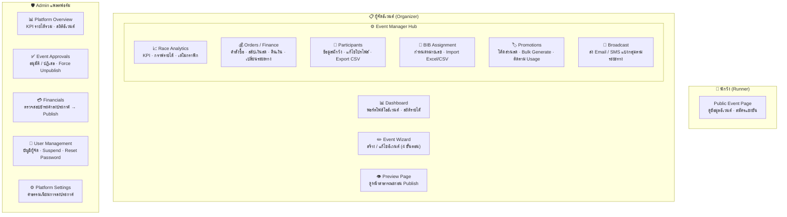

# MyTrails — UX Prototype Handoff

Functional prototype สำหรับส่งต่อให้ทีม Developer — ไม่ใช่ production code ข้อมูลทั้งหมดเป็น mock data ไม่มี backend call

---

## Platform Overview



**Event Lifecycle (Admin-driven):**
`draft` → `pending_review` → `awaiting_payment` → `ready_to_publish` → `live`

---

## Local Setup

```sh
npm install
npm run dev
# → http://localhost:5173
```

| Email | Password | Role |
|-------|----------|------|
| ใดก็ได้ | ใดก็ได้ | Organizer |
| `admin@mytrails.com` | ใดก็ได้ | Admin |

---

## Tech Stack

| Layer | Library |
|-------|---------|
| Framework | React 18 + TypeScript + Vite |
| Routing | react-router-dom v6 |
| UI | shadcn/ui (Radix UI) + Tailwind CSS |
| Charts | Recharts |
| Icons | lucide-react |

---

## Mock Data → Real API

ข้อมูลทั้งหมดอยู่ใน `src/data/mockData.ts` — replace ด้วย API call ตรงนี้จุดเดียว views ไม่ต้องแก้

Business logic (refund policy, distance change policy) อยู่ใน `src/lib/` แยกออกจาก UI — migrate ไป backend ได้เลย มี unit tests ใน `src/test/`
