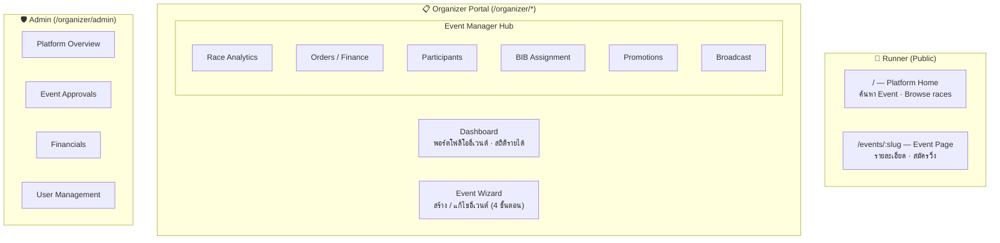

# MyTrails

  

Trail running event platform for Thailand — ระบบค้นหาและสมัครงานวิ่งเทรล พร้อมระบบจัดการ Event สำหรับ Organizer

---

## Platform Overview


```mermaid
flowchart TB
    subgraph Runner["🏃 Runner (Public)"]
        R1["/ — Platform Home\nค้นหา Event · Browse races"]
        R2["/events/:slug — Event Page\nรายละเอียด · สมัครวิ่ง"]
    end

    subgraph Organizer["📋 Organizer Portal (/organizer/*)"]
        O1["Dashboard\nพอร์ตโฟลิโออีเวนต์ · สถิติรายได้"]
        O2["Event Wizard\nสร้าง / แก้ไขอีเวนต์ (4 ขั้นตอน)"]
        subgraph Hub["Event Manager Hub"]
            H1["Race Analytics"]
            H2["Orders / Finance"]
            H3["Participants"]
            H4["BIB Assignment"]
            H5["Promotions"]
            H6["Broadcast"]
        end
    end

    subgraph Admin["🛡️ Admin (/organizer/admin)"]
        A1["Platform Overview"]
        A2["Event Approvals"]
        A3["Financials"]
        A4["User Management"]
    end
```

**Event Lifecycle:** `draft` → `pending_review` → `awaiting_payment` → `ready_to_publish` → `live`

---

## Routes

| URL | Description |
|-----|-------------|
| `/` | Runner Landing — platform home, browse all events |
| `/events/pong-yaeng-trail-2026` | Pong Yaeng Trail 2026 event page |
| `/organizer/login` | Organizer login |
| `/organizer/dashboard` | Organizer dashboard |
| `/organizer/events/*` | Event management |
| `/organizer/admin` | Platform admin |

---

## Local Setup

```sh
npm install
npm run dev   # → https://localhost:8080
npm run test  # vitest
npm run build
```

**Login (mock):**

| Email | Password | Role |
|-------|----------|------|
| ใดก็ได้ | ใดก็ได้ | Organizer |
| `admin@mytrails.com` | ใดก็ได้ | Admin |

---

## Tech Stack

| Layer | Library |
|-------|---------|
| Framework | React 18 + TypeScript + Vite |
| Routing | react-router-dom v6 |
| UI (Organizer) | shadcn/ui (Radix UI) + Tailwind CSS |
| UI (Runner) | Inline styles + custom CSS design tokens |
| Charts | Recharts |
| Icons | lucide-react |

---

## Src Structure

```
src/
├── views/
│   ├── AuthView, DashboardView, EventWizard, EventManagerHub, AdminDashboard
│   └── runner/
│       ├── RunnerLandingPage.tsx      # platform home
│       ├── RunnerComponents.tsx       # shared runner primitives
│       └── pyt-landing/              # Pong Yaeng Trail 2026
├── components/ui/                    # shadcn/ui
├── contexts/AuthContext.tsx
├── data/mockData.ts                  # ← replace with API calls here
└── lib/                              # refundPolicy, distanceChangePolicy
```

---

## Mock Data → Real API

ข้อมูลทั้งหมดอยู่ใน `src/data/mockData.ts` — replace ด้วย API call ตรงนี้จุดเดียว views ไม่ต้องแก้

Business logic ใน `src/lib/` แยกออกจาก UI — มี unit tests พร้อม migrate ไป backend
