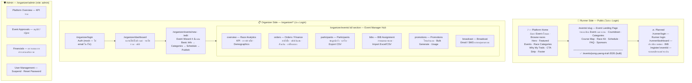

# MyTrails

   

แพลตฟอร์มค้นหาและสมัครงานวิ่งเทรลในไทย มี 2 ฝั่ง: **Runner** (นักวิ่ง) และ **Organizer** (ผู้จัดงาน)

---

## ภาพรวม Platform


```mermaid
flowchart TB
    subgraph Runner["🏃 Runner Side — Public (ไม่ต้อง Login)"]
        R1["/ — Platform Home
        ค้นหา Event ทั้งหมด · Browse races
        Hero · Featured Events · Race Categories
        Why My Trails · CTA Strip · Footer"]
        R2["/events/:slug — Event Landing Page
        รายละเอียด Event เฉพาะงาน · Countdown · Categories
        Course Map · Race Kit · Schedule · FAQ · Sponsors
        ─────────────────────────────
        ✅ /events/pong-yaeng-trail-2026 (built)"]
        R3["🔜 Planned
        /runner/login — Runner login
        /runner/dashboard — ประวัติการสมัคร · BIB
        /register/:eventId — ระบบสมัครและชำระเงิน"]
        R1 --> R2
        R2 --> R3
    end

    subgraph Organizer["📋 Organizer Side — /organizer/* (ต้อง Login)"]
        O1["/organizer/login
        Auth (mock — ใส่ email ใดก็ได้)"]
        O2["/organizer/dashboard
        พอร์ตโฟลิโออีเวนต์ · รายได้รวม · สถิติ"]
        O3["/organizer/events/new · /edit
        Event Wizard 4 ขั้นตอน
        Basic Info → Categories → Schedule → Publish"]
        subgraph Hub["/organizer/events/:id/:section — Event Manager Hub"]
            H1["overview — Race Analytics
            KPI · กราฟรายได้ · Demographics"]
            H2["orders — Orders / Finance
            คำสั่งซื้อ · สลิปเงินสด · คืนเงิน · เปลี่ยนระยะ"]
            H3["participants — Participants
            ข้อมูลนักวิ่ง · แก้ไข · Export CSV"]
            H4["bibs — BIB Assignment
            กำหนดหมายเลข · Import Excel/CSV"]
            H5["promotions — Promotions
            โค้ดส่วนลด · Bulk Generate · Usage"]
            H6["broadcast — Broadcast
            Email / SMS แบ่งกลุ่มตามระยะ"]
        end
        O1 --> O2 --> O3 --> Hub
    end

    subgraph Admin["🛡️ Admin — /organizer/admin (role: admin)"]
        A1["Platform Overview — KPI รวม"]
        A2["Event Approvals — อนุมัติ / ปฏิเสธ"]
        A3["Financials — ตรวจสอบการชำระค่าลงประกาศ"]
        A4["User Management — Suspend · Reset Password"]
    end
```

**Event Lifecycle (Admin-driven):**
`draft` → `pending_review` → `awaiting_payment` → `ready_to_publish` → `live`

---

## สิ่งที่ Build แล้ว vs Planned

| Feature | Status |
|---------|--------|
| Runner — Platform Home (`/`) | ✅ Built |
| Runner — Pong Yaeng Trail 2026 (`/events/pong-yaeng-trail-2026`) | ✅ Built |
| Organizer — Login / Dashboard / Event Wizard / Hub | ✅ Built (mock data) |
| Admin — Dashboard / Approvals / Financials / Users | ✅ Built (mock data) |
| Runner — Login / Profile / Registration history | 🔜 Planned |
| Runner — Registration & Payment flow | 🔜 Planned |
| Runner — Generic event pages (`/events/:slug`) | 🔜 Planned |
| Real backend / database | 🔜 Planned |

---

## Local Setup

```sh
npm install
npm run dev   # → https://localhost:8080 (self-signed cert — browser warning ปกติ)
```

> ถ้า port 8080 ถูกใช้อยู่ Vite จะขยับไป 8081, 8082 อัตโนมัติ

### Login

| Email | Password | Role |
|-------|----------|------|
| ใดก็ได้ | ใดก็ได้ | Organizer |
| `admin@mytrails.com` | ใดก็ได้ | Admin |

### Test flows ที่แนะนำ

**Runner side:**
1. เปิด `/` — ดู Platform Home, กด Browse Races, filter by region
2. เปิด `/events/pong-yaeng-trail-2026` — ดู Hero video, เลื่อนดู Race Categories, Course Map, FAQ

**Organizer side:**
1. Login ด้วย email ใดก็ได้ → เข้า `/organizer/dashboard`
2. กด "Create Event" → ทำ Event Wizard 4 ขั้นตอน
3. เข้า Event ที่มีอยู่ → ลอง Orders / Finance, BIB Assignment, Promotions

**Admin side:**
1. Login ด้วย `admin@mytrails.com` → เข้า `/organizer/admin`
2. ดู Event Approvals — approve หรือ reject event

---

## Tech Stack

| Layer | Library |
|-------|---------|
| Framework | React 18 + TypeScript + Vite |
| Routing | react-router-dom v6 |
| UI — Organizer | shadcn/ui (Radix UI) + Tailwind CSS |
| UI — Runner | Inline styles + CSS design tokens (ตาม Claude Design prototype) |
| Charts | Recharts |
| Icons | lucide-react |
| Tests | Vitest |

---

## Src Structure

```
src/
├── views/
│   ├── AuthView.tsx, DashboardView.tsx     # Organizer
│   ├── EventWizard.tsx, EventManagerHub.tsx
│   ├── PublicEventPage.tsx
│   ├── admin/
│   └── runner/
│       ├── RunnerLandingPage.tsx           # Platform home (/)
│       ├── RunnerComponents.tsx            # Shared runner primitives
│       └── pyt-landing/                   # /events/pong-yaeng-trail-2026
│           ├── PongYaengTrailPage.tsx
│           ├── hero-styles.css
│           └── landing-styles.css
├── components/ui/                          # shadcn/ui
├── contexts/AuthContext.tsx                # Mock auth — replace with real
├── data/mockData.ts                        # ← Replace ด้วย API calls ที่นี่
└── lib/                                    # Business logic (unit-tested)
    ├── refundPolicy.ts
    └── distanceChangePolicy.ts
```

---

## Mock Data → Real API

ข้อมูลทั้งหมดอยู่ใน `src/data/mockData.ts` — replace ด้วย API call ตรงนี้จุดเดียว views ไม่ต้องแก้

Business logic ใน `src/lib/` แยกออกจาก UI พร้อม unit tests — migrate ไป backend ได้เลย

```sh
npm run test   # run unit tests
```
