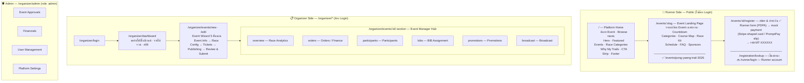

# MyTrails

 

แพลตฟอร์มสำหรับงานวิ่งเทรลในประเทศไทย — นักวิ่งค้นหาและสมัครงานวิ่ง ผู้จัดงานสร้างและบริหาร Event

---

## แอปนี้คืออะไร

MyTrails เชื่อมต่อ 2 กลุ่มผู้ใช้:

**นักวิ่ง (Runner)** — เข้ามาดูว่ามีงานวิ่งเทรลอะไรบ้างในไทย เลือกระยะที่สนใจ แล้วสมัครได้เลย ตั้งแต่ 10K สำหรับมือใหม่ไปจนถึง 160K Ultra

**ผู้จัดงาน (Organizer)** — เข้ามาสร้าง Event กำหนดระยะ ราคา และตาราง จากนั้นจัดการผู้สมัคร ออก BIB ตรวจสอบการเงิน และส่ง Broadcast ให้นักวิ่ง

ก่อน Event จะ Live ต้องผ่าน Admin อนุมัติก่อนเสมอ

---

## ลองเล่นได้ที่ไหน

> นี่คือ **prototype** (ตัว demo ที่ `mytrails.theingress.co`) — ตอนนี้ต่อ Supabase จริงแล้ว
> (ไม่ใช่ mock) จึงสมัครวิ่งได้ครบและข้อมูลถูกเก็บจริง ฝั่ง Organizer/Admin ต้องใช้บัญชี demo
> ที่กำหนดไว้ (**ขอได้จากผู้ดูแล** ไม่เปิดเผยในที่สาธารณะ) ส่วนฝั่ง Runner เล่นได้เลยไม่ต้อง login

**ดูทุกหน้าจอแบบ isolated (ไม่ต้อง login):** [`mytrails.theingress.co/journey`](https://mytrails.theingress.co/journey) — catalog รวมทุก user journey (Storybook)

**ฝั่ง Runner** — เปิด browser เข้าได้เลย ไม่ต้อง login

| URL | เนื้อหา |
|-----|---------|
| `mytrails.theingress.co/` | หน้าหลัก — ดู Event ทั้งหมด กรองตามภาค |
| `mytrails.theingress.co/events/pong-yaeng-trail-2026` | ตัวอย่าง Event จริง — Pong Yaeng Trail 2026 |
| `mytrails.theingress.co/events/:id/register` | **สมัคร + จ่ายเงิน** (mock Stripe / PromptPay + อัพสลิป) → ได้รหัส `MT-XXXXXX` |
| `mytrails.theingress.co/registration/lookup` | เช็คสถานะการสมัครด้วย email + รหัส |

**ฝั่ง Organizer** — login ด้วยบัญชี demo แล้วเล่นได้ทุก feature

| URL | เนื้อหา |
|-----|---------|
| `mytrails.theingress.co/organizer/login` | หน้า Login |
| `mytrails.theingress.co/organizer/dashboard` | Dashboard — พอร์ตโฟลิโอ Event + กระดิ่งแจ้งเตือน 🔔 |
| `mytrails.theingress.co/organizer/events/new` | สร้าง Event ใหม่ (5 ขั้นตอน) |
| `mytrails.theingress.co/organizer/outbox` | กล่องอีเมล (mock) — แจ้งอนุมัติ/สมัคร/payout |

เมื่อ login เข้า Event ใดก็ได้จาก Dashboard จะเจอ **Event Manager Hub** ซึ่งมี:
- **Orders / Finance** — คำสั่งซื้อ, คิวตรวจสลิป PromptPay, คืนเงิน, เปลี่ยนระยะ
- **Participants** — รายชื่อนักวิ่งจริงจากการสมัคร, แก้ไขข้อมูล, Export CSV
- **BIB Assignment** — กำหนดหมายเลข BIB
- **Promotions** — สร้างโค้ดส่วนลด
- **Broadcast** — ส่ง Email / SMS ให้นักวิ่งแบ่งตามระยะ
- **Race Analytics** — KPI, กราฟรายได้, Demographics

**ฝั่ง Admin** — login ด้วยบัญชี admin demo

| URL | เนื้อหา |
|-----|---------|
| `mytrails.theingress.co/organizer/admin` | อนุมัติ/ตีกลับ Event, Payout & Escrow, จัดการ User + Tier (ค่าคอมมิชชั่น), Platform Settings |

---

## Local Setup

```sh
npm install
npm run dev              # → https://localhost:8080 (โหมด mock — ไม่ต้องมี backend)
npm run test             # vitest
npm run storybook        # catalog หน้าจอทุก journey → http://localhost:6006
```

`npm run dev` รันโหมด **mock** (ข้อมูลอยู่ใน `localStorage` ไม่ต้องต่อ backend) — login **ใส่อะไรก็ได้**:

| Email | Password | Role |
|-------|----------|------|
| ใดก็ได้ | ใดก็ได้ | Organizer |
| `admin@mytrails.com` | ใดก็ได้ | Admin |

> ตัว demo ที่ deploy ไว้ (`mytrails.theingress.co`) รันโหมด **supabase** (`VITE_DATA_SOURCE=supabase npm run build`)
> ซึ่งใช้ auth จริง — บัญชี demo ต้องขอจากผู้ดูแล ไม่ใช่ "ใส่อะไรก็ได้"

---

## Platform Overview


```mermaid
flowchart TB
    subgraph Runner["🏃 Runner Side — Public (ไม่ต้อง Login)"]
        R1["/ — Platform Home
        ค้นหา Event · Browse races
        Hero · Featured Events · Race Categories
        Why My Trails · CTA Strip · Footer"]
        R2["/events/:slug — Event Landing Page
        รายละเอียด Event เฉพาะงาน · Countdown
        Categories · Course Map · Race Kit
        Schedule · FAQ · Sponsors
        ─────────────────────────
        ✅ /events/pong-yaeng-trail-2026"]
        R3["/events/:id/register — สมัคร & ชำระเงิน ✅
        Runner form (PDPA) → mock payment
        (Stripe-shaped card / PromptPay slip)
        → รหัส MT-XXXXXX
        ─────────────────────────
        /registration/lookup — เช็คสถานะ
        🔜 /runner/login — Runner account"]
        R1 --> R2 --> R3
    end

    subgraph Organizer["📋 Organizer Side — /organizer/* (ต้อง Login)"]
        O1["/organizer/login"]
        O2["/organizer/dashboard
        พอร์ตโฟลิโออีเวนต์ · รายได้รวม · สถิติ"]
        O3["/organizer/events/new · /edit
        Event Wizard 5 ขั้นตอน
        Event Info → Race Config → Tickets → Publishing → Review & Submit"]
        subgraph Hub["/organizer/events/:id/:section — Event Manager Hub"]
            H1["overview — Race Analytics"]
            H2["orders — Orders / Finance"]
            H3["participants — Participants"]
            H4["bibs — BIB Assignment"]
            H5["promotions — Promotions"]
            H6["broadcast — Broadcast"]
        end
        O1 --> O2 --> O3 --> Hub
    end

    subgraph Admin["🛡️ Admin — /organizer/admin (role: admin)"]
        A1["Event Approvals"]
        A2["Financials"]
        A3["User Management"]
        A4["Platform Settings"]
    end
```

**Event Lifecycle:**
`draft` → `pending_review` → (Admin อนุมัติ) → `live` (ถ้าเลือก publish ทันที) หรือ `scheduled` → `live` (ตามวันเวลาที่ตั้ง)
`pending_review` → (ตีกลับ) → `rejected` → แก้แล้วส่งใหม่ · แก้ Event ที่อนุมัติแล้ว = ต้องรีวิวใหม่

**Commission (2 ส่วน):** Event commission ตามจำนวนผู้สมัคร (`<300` = ฿1,000 · `300–999` = 8% · `≥1000` = 6%) + Tier commission ตาม tier ของบัญชี — หักตอนจ่ายเงินคืนผู้จัด (payout คิดจากยอดสมัครจริง)

---

## Tech Stack

| Layer | Library |
|-------|---------|
| Framework | React 18 + TypeScript + Vite |
| Routing | react-router-dom v6 |
| UI — Organizer/Admin | shadcn/ui (Radix UI) + Tailwind CSS |
| UI — Runner | Inline styles + CSS design tokens |
| Backend | Supabase — Postgres + Auth + Storage + pg_cron |
| Charts | Recharts |
| Tests | Vitest |
| Hand-off catalog | Storybook (`/journey`) |

---

## Data layer — สลับ mock ↔ Supabase ด้วย flag เดียว

ทุก view อ่าน-เขียนผ่าน **shared store ก้อนเดียว** — `src/contexts/EventsContext.tsx` (`EventsProvider`)
โดยมี `VITE_DATA_SOURCE` (`src/lib/dataSource.ts`) เป็นตัวสลับ backend:

| โหมด | เป็นค่าเริ่มต้นของ | เก็บข้อมูลที่ |
|------|-------------------|--------------|
| `mock` | dev / test / Storybook | `localStorage` (seed จาก `src/data/mockData.ts` + `adminMockData.ts`) |
| `supabase` | **ตัว demo ที่ deploy** (`mytrails.theingress.co`) | Postgres จริง — schema เท่ากับ store, business rule (capacity/ช่วงขาย/กันสมัครซ้ำ) บังคับใน RPC ฝั่ง server, RLS แยกสิทธิ์ anon/organizer/admin, Storage เก็บสลิป |

- **Reads** ผ่าน `src/hooks/data/*` — โครง API เหมือนกันทั้งสองโหมด views ไม่ต้องแก้
- โหมด supabase: adapter อยู่ที่ `src/lib/supabaseAdapter.ts`, auth = Supabase (map เป็น role/organizerId เดิม), scheduled-publish + payout tick รันด้วย `pg_cron` ใน DB
- Business logic ที่ทดสอบได้ (`refundPolicy`, `distanceChangePolicy`, `eventPhase`, `payments/`) อยู่ใน `src/lib/` พร้อม unit tests (`src/test/`)
