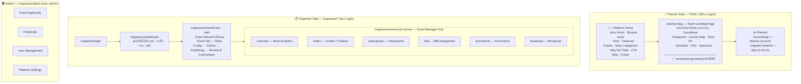

# MyTrails

 

แพลตฟอร์มสำหรับงานวิ่งเทรลในประเทศไทย — นักวิ่งค้นหาและสมัครงานวิ่ง ผู้จัดงานสร้างและบริหาร Event

---

## แอปนี้คืออะไร

MyTrails เชื่อมต่อ 2 กลุ่มผู้ใช้:

**นักวิ่ง (Runner)** — เข้ามาดูว่ามีงานวิ่งเทรลอะไรบ้างในไทย เลือกระยะที่สนใจ แล้วสมัครได้เลย ตั้งแต่ 10K สำหรับมือใหม่ไปจนถึง 160K Ultra

**ผู้จัดงาน (Organizer)** — เข้ามาสร้าง Event กำหนดระยะ ราคา และตาราง จากนั้นจัดการผู้สมัคร ออก BIB ตรวจสอบการเงิน และส่ง Broadcast ให้นักวิ่ง

ก่อน Event จะ Live ต้องผ่าน Admin อนุมัติก่อนเสมอ

---

## ลองเล่นได้ที่ไหน

**ฝั่ง Runner** — เปิด browser เข้าได้เลย ไม่ต้อง login

| URL | เนื้อหา |
|-----|---------|
| `mytrails.theingress.co/` | หน้าหลัก — ดู Event ทั้งหมด กรองตามภาค |
| `mytrails.theingress.co/events/pong-yaeng-trail-2026` | ตัวอย่าง Event จริง — Pong Yaeng Trail 2026 |

**ฝั่ง Organizer** — login ก่อน แล้วเล่นได้ทุก feature

| URL | เนื้อหา |
|-----|---------|
| `mytrails.theingress.co/organizer/login` | หน้า Login |
| `mytrails.theingress.co/organizer/dashboard` | Dashboard — พอร์ตโฟลิโอ Event ทั้งหมด |
| `mytrails.theingress.co/organizer/events/new` | สร้าง Event ใหม่ (5 ขั้นตอน) |

เมื่อ login เข้า Event ใดก็ได้จาก Dashboard จะเจอ **Event Manager Hub** ซึ่งมี:
- **Orders / Finance** — คำสั่งซื้อ, ตรวจสลิปเงินสด, คืนเงิน, เปลี่ยนระยะ
- **Participants** — รายชื่อนักวิ่ง, แก้ไขข้อมูล, Export CSV
- **BIB Assignment** — กำหนดหมายเลข BIB
- **Promotions** — สร้างโค้ดส่วนลด
- **Broadcast** — ส่ง Email / SMS ให้นักวิ่งแบ่งตามระยะ
- **Race Analytics** — KPI, กราฟรายได้, Demographics

**ฝั่ง Admin** — login ด้วย `admin@mytrails.com`

| URL | เนื้อหา |
|-----|---------|
| `mytrails.theingress.co/organizer/admin` | อนุมัติ/ตีกลับ Event, Payout & Escrow, จัดการ User + Tier (ค่าคอมมิชชั่น), Platform Settings |

---

## Local Setup

```sh
npm install
npm run dev   # → https://localhost:8080
```

**Login (ข้อมูล mock — ใส่อะไรก็ได้):**

| Email | Password | Role |
|-------|----------|------|
| ใดก็ได้ | ใดก็ได้ | Organizer |
| `admin@mytrails.com` | ใดก็ได้ | Admin |

---

## Platform Overview


```mermaid
flowchart TB
    subgraph Runner["🏃 Runner Side — Public (ไม่ต้อง Login)"]
        R1["/ — Platform Home
        ค้นหา Event · Browse races
        Hero · Featured Events · Race Categories
        Why My Trails · CTA Strip · Footer"]
        R2["/events/:slug — Event Landing Page
        รายละเอียด Event เฉพาะงาน · Countdown
        Categories · Course Map · Race Kit
        Schedule · FAQ · Sponsors
        ─────────────────────────
        ✅ /events/pong-yaeng-trail-2026"]
        R3["🔜 Planned
        /runner/login — Runner account
        /register/:eventId — สมัคร & ชำระเงิน"]
        R1 --> R2 --> R3
    end

    subgraph Organizer["📋 Organizer Side — /organizer/* (ต้อง Login)"]
        O1["/organizer/login"]
        O2["/organizer/dashboard
        พอร์ตโฟลิโออีเวนต์ · รายได้รวม · สถิติ"]
        O3["/organizer/events/new · /edit
        Event Wizard 5 ขั้นตอน
        Event Info → Race Config → Tickets → Publishing → Review & Commission"]
        subgraph Hub["/organizer/events/:id/:section — Event Manager Hub"]
            H1["overview — Race Analytics"]
            H2["orders — Orders / Finance"]
            H3["participants — Participants"]
            H4["bibs — BIB Assignment"]
            H5["promotions — Promotions"]
            H6["broadcast — Broadcast"]
        end
        O1 --> O2 --> O3 --> Hub
    end

    subgraph Admin["🛡️ Admin — /organizer/admin (role: admin)"]
        A1["Event Approvals"]
        A2["Financials"]
        A3["User Management"]
        A4["Platform Settings"]
    end
```

**Event Lifecycle:**
`draft` → `pending_review` → (Admin อนุมัติ) → `live` (ถ้าเลือก publish ทันที) หรือ `scheduled` → `live` (ตามวันเวลาที่ตั้ง)
`pending_review` → (ตีกลับ) → `rejected` → แก้แล้วส่งใหม่ · แก้ Event ที่อนุมัติแล้ว = ต้องรีวิวใหม่

**Commission (2 ส่วน):** Event commission ตามจำนวนผู้สมัคร (`<300` = ฿1,000 · `300–999` = 8% · `≥1000` = 6%) + Tier commission ตาม tier ของบัญชี — หักตอนจ่ายเงินคืนผู้จัด (payout คิดจากยอดสมัครจริง)

---

## Tech Stack

| Layer | Library |
|-------|---------|
| Framework | React 18 + TypeScript + Vite |
| Routing | react-router-dom v6 |
| UI — Organizer | shadcn/ui (Radix UI) + Tailwind CSS |
| UI — Runner | Inline styles + CSS design tokens |
| Charts | Recharts |
| Tests | Vitest |

---

## Mock Data → Real API

ข้อมูลเป็น mock ทั้งหมด (ยังไม่มี backend) แต่อยู่ใน **shared store ก้อนเดียว** — `src/contexts/EventsContext.tsx` (`EventsProvider`) เก็บ state ใน `localStorage` ทั้ง Organizer / Admin / Runner อ่าน-เขียนจากที่เดียวกัน กด action ฝั่งไหนอีกฝั่งเห็นทันที

- **Reads** ผ่าน `src/hooks/data/*` (`useEvents`/`useAdminData`) — สลับเป็น React Query + API ตรงนี้จุดเดียว views ไม่ต้องแก้
- **Seed** จาก `src/data/mockData.ts` + `src/data/adminMockData.ts`
- Business logic ใน `src/lib/` แยกจาก UI พร้อม unit tests (`src/test/`) — migrate ไป backend ได้เลย
